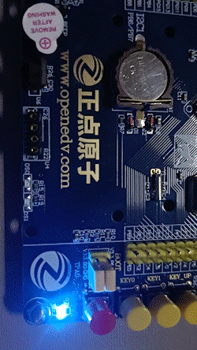
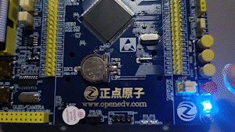

# 项目说明

基于正点原子 STM32F103ZET6 开发板的学习仓库，保存 2022 年秋季学期学习《嵌入式系统设计与开发》课程的学习代码和实验代码。

# GPIO_LIGHT

实现目标：通过 GPIO 轮询实现 LED0、LED1 同时闪烁（红、绿）。

实验结果：认识 GPIO，一个基本的输入输出，可以获取引脚上的状态或设置引脚所对应设备的状态。

实验备注：2022 年秋季学期第八周自主学习。LED0 的引脚是 PB5、LED1 的引脚是 PE5。

# GPIO_KEY_LIGHT

实现目标：通过 GPIO 轮询实现 KEY_UP、KEY1 按键分别控制 LED0、LED1 的闪烁。

实验结果：认识 GPIO，一个基本的输入输出，可以获取引脚上的状态或设置引脚所对应设备的状态。

实验备注：2022 年秋季学期第八周自主学习。

# GPIO_INTER_LIGHT

实现目标：通过中断实现 KEY0 对 LED1（绿灯）的控制。

实验结果：认识中断，掌握中断的执行流程：1. 中断向量号 2. 中断向量表 3. 中断服务程序 4. 恢复主程序

实验备注：2022 年秋季学期第八周自主学习。
